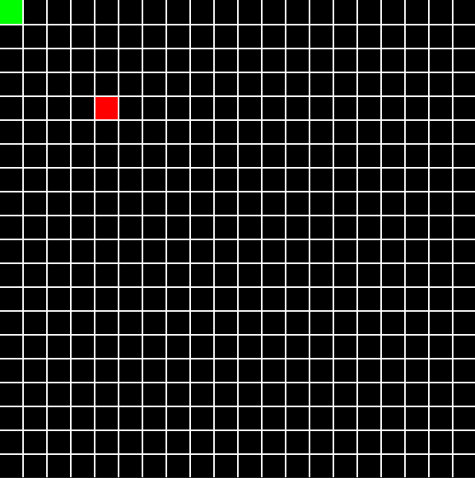

# **Summer 2023 Self-Project into RL (Snake Game)**



*Q-learning agent reaching 51 points after training for 500 episodes*

As a way to learn more about RL, I created this project to play the snake game using a simple Q-learning agent, as well as, A2C and PPO agents from Stable-baselines3. The snake game is made using the pygame library, and the environment follows an OpenAI structure to enable the use of [gymnasium](https://gymnasium.farama.org/content/basic_usage/) and [Stable-Baselines3](https://stable-baselines3.readthedocs.io/en/master/index.html).

## Implementation Summary

Actions:
- 0: Turn Left
- 1: Continue in the current direction
- 2: Turn Right

Reward function:
- **-500**: If snake agent crashes into any of the four boundaries, or itself
- **-1**: For each action/timestep the agent takes to reach the apple
- **+100**: For eating the apple

Observations:
- **0-7**: The quadrant apple position is from snake's head, with North as 0 and increasing CCW to 7 at NW
- **[0-1, 0-1, 0-1]**: Three element array that contains 0 if there is no wall/body in each adjacent sqaure around the snake's head, 1 if otherwise.

## Installation

To get started, you can clone the repo in your desired directory through the following command on the cmd line:
```
git clone https://github.com/Kuzcop/snake.git
```

You will also need the following libraries to run the relevant files in the repo:
```
pip install pygame
pip install gymnasium
pip install stable-baselines3[extra] 
```
*Note that Stable-Baselines3 requires python 3.8+ and PyTorch >= 1.13*

To train and test an agent:
```
# Example:
python RL_snake_play.py -m qlearn -s 20 --train
python RL_snake_play.py -m qlearn -s 20 --test
```

To run other models and vary the size of the play area, can provide the following alternative flags:
```
Q-learning: -m qlearn
A2C: -m a2c
PPO: -m PPO

To generate a SxS play area: -s S
# Note: you can change play area length between training and testing agent
```
Play yourself!
```
python snake_game.py
```
Use the arrow keys to navigate the snake.

## Repo Overview
This repository contains files to play the snake game as yourself, or to let an RL agent play the game:

- [Snake](snake.py): This file holds the snake class with attributes describing the snake body's position and special methods to check against different collisions.
- [RL Snake Play](RL_snake_play.py): To play the game using RL agents, run this file with the name of the agent model you wish to play the game. Currently, there is support for A2C, Q-learning, and PPO. Use --h to learn more about how to run the file from the cmd line. <br />
Example: <br />  (To train) python RL_snake_play.py -s 20 -m qlearn --train <br /> (To test) python RL_snake_play.py -s 20 -m qlearn --test
- [Snake Environment](snake_environment): This environment follows the OpenAi Gymnasium structure for environments. The action space and observation space for all agents are the same.<br />
**Action space**: spaces.Discrete(3) <br />
**Observation space**: (spaces.Discrete(8), spaces.Box(0, 1, shape=(3,), dtype=int) <br />
*reset()* will put the snake back in the starting position, top left of the screen, reposition the apple, and reset distance measurements to the apple. *step()* moves the snake and then checks if the agent has crashed into a wall, eaten its body, or eaten an apple.
- [Snake Game](snake_game.py): Run this file to play the snake game yourself. Arrow keys to move.
- [Snake Helper](snake_helper.py): Miscellaneous functions for generating and saving learning curve plots. It also contains the code used to facilitate training and testing different models
- [Snake Agent](snake_agent.py): The file contains the class for creating a Q-learning snake agent.
- [q_learn.pkl](q_learn.pkl): Pickle file to run a working version of the Q-learning agent 
